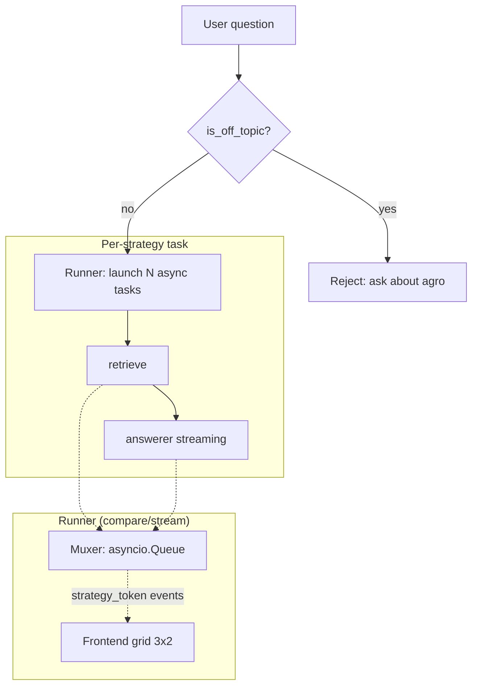
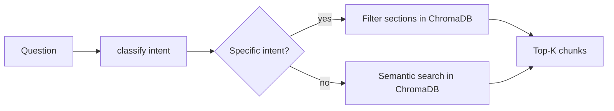
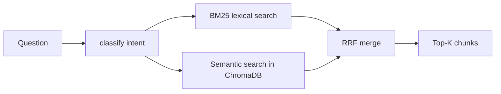
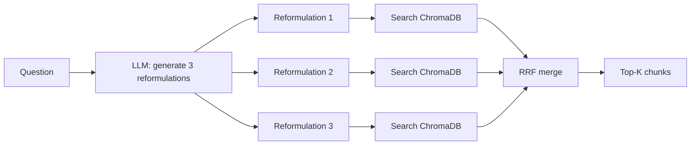

# RAG Strategies — Comparator

## What is it

The comparator runs **6 different retrieval strategies** on the same question and displays them side by side. The **answerer** (the LLM that generates the final answer) is **exactly the same** for all 6: gpt-4.1-nano with the rioplatense system prompt.

This isolates the retrieval effect: the only thing that changes between strategies is **how chunks are retrieved** from the magazine. The prompt, model, and generation are identical.

## Architecture



---

## Strategy comparison at a glance

| # | Strategy | LLM calls | Speed | Best for |
|---|----------|-----------|-------|----------|
| 1 | Baseline | 0 | ~500ms | Direct questions, control group |
| 2 | Hybrid BM25 | 0 | ~600ms | Lexical + semantic coverage |
| 3 | Rerank LLM | 1 | +3-5s | Cleaning noisy top results |
| 4 | Query Rewrite | 1 | +2-4s | Follow-up / vague questions |
| 5 | Multi Query | 1 | +3-5s | Maximising recall |
| 6 | HyDe | 1 | +3-5s | Short or poorly worded questions |

---

## 1. Baseline (Semantic)



**Pipeline:**
1. Classifies intent using `_classify()` (rule-based, ~1ms, no LLM)
2. Searches top-K in ChromaDB by cosine similarity (`text-embedding-3-small`)
3. If the intent has associated sections (e.g. "costos" → costos_margenes, costos_operativos), filters by those sections
4. Returns K most similar chunks

**LLM cost:** 0 calls
**Speed:** very fast (~500ms)
**Tradeoff:** good for direct questions. No expansion or reformulation.

**When to use:** control group — replicates exactly what the main chat does.

---

## 2. Hybrid BM25



**Pipeline:**
1. Classifies intent (same as baseline)
2. Runs **two retrievers in parallel**:
   - **BM25**: lexical search over chunk text using `rank_bm25` (cached index in memory)
   - **Semantic**: embedding search in ChromaDB (same as baseline)
3. Merges both rankings with **Reciprocal Rank Fusion (RRF)**: `score = 1/(k + rank)`
4. Section filter applied to both retrievers before merging

**LLM cost:** 0 calls
**Speed:** fast (~600ms, BM25 is near-instant)
**Tradeoff:** captures exact lexical matches (e.g. "glifosato 96%") that embeddings might miss, and semantic matches that BM25 alone would miss.

---

## 3. Rerank LLM


**Pipeline:**
1. Retrieves top-N (N > K, e.g. 20) from semantic search
2. Sends the N chunks to the LLM with a strict prompt: *"return a JSON array with the K most relevant indices"*
3. Reorders chunks according to LLM ranking
4. Falls back to original ChromaDB order if JSON parsing fails

**LLM cost:** 1 call (the reranker)
**Speed:** slow (~3-5s extra for the reranking LLM call)
**Tradeoff:** the LLM understands the question and can pick chunks that pure embedding similarity would not prioritise. Useful when the top semantic results are noisy.

**Note:** uses the **same** gpt-4.1-nano as the answerer. The idea is to show that the same model with different prompts behaves differently.

---

## 4. Query Rewrite


**Pipeline:**
1. Takes the question + conversation history
2. Sends to LLM with a prompt: *"rewrite the question to be self-contained, with no vague references (e.g. 'and that?', 'that zone', 'the previous one')"*
3. Uses the rewritten question for semantic search (with intent filter)
4. Discards the rewritten question after retrieval (it only serves to find better chunks)

**LLM cost:** 1 call (the rewrite)
**Speed:** medium (~2-4s extra for the rewrite)
**Tradeoff:** significantly improves follow-up questions. For well-formed initial questions, the rewrite changes almost nothing.

**Example:**
```
User: "how much does it cost to plant soy in the north zone?"
User: "what about the south zone?"           ← vague follow-up
Rewrite: "how much does it cost to plant soy in the south zone?"  ← self-contained
```

---

## 5. Multi Query



**Pipeline:**
1. Sends the question to the LLM: *"generate 3 different reformulations covering different angles or emphasis"*
2. Each reformulation is searched separately in ChromaDB
3. All 3 rankings are merged with **RRF** (same as Hybrid)
4. Returns top-K from the merged ranking

**LLM cost:** 1 call (generate 3 reformulations) + 3 embeddings (one per reformulation)
**Speed:** medium (~3-5s, 3 sequential searches)
**Tradeoff:** expands recall — a single phrasing might not cover all relevant chunks. Three versions cover more vector store surface. RRF amplifies chunks appearing in multiple rankings (relevance signal).

---

## 6. HyDe (Hypothetical Document Embeddings)


**Pipeline:**
1. Sends the question to the LLM: *"write a brief paragraph that SIMULATES being the answer to this question, as if written in the magazine. Do NOT use real knowledge, just format and style."*
2. Embeds that hypothetical paragraph with `text-embedding-3-small`
3. Uses that embedding to search ChromaDB (instead of the original question)
4. Applies intent filter normally

**LLM cost:** 1 call (generate the hypothetical document)
**Speed:** medium (~3-5s)
**Tradeoff:** the hypothesis (from Gao et al. 2022 paper) is that the embedding of a well-formed answer matches real chunks better than the embedding of a short colloquial question. Works well for short or poorly worded queries.

---

## 7. Rerank CE (cross-encoder, extra — not in the default comparator)


**Pipeline:**
1. Retrieves top-N (e.g. 20) from semantic search — same as Rerank LLM
2. POSTs the N chunks to a dedicated cross-encoder service (Jina-compatible `/v1/rerank`, running **Qwen3-Reranker-0.6B** via mlx-lm on the Mac mini, `:8001`)
3. Reorders chunks by `relevance_score`
4. Falls back to original ChromaDB order if the service is unreachable (never breaks the response)

**LLM cost:** 0 (no generative LLM involved)
**Speed:** very fast (~0.5s per 20 chunks warm, ~16x faster than Rerank LLM)
**Tradeoff:** strong score discrimination (0.98/0.47 vs 0.01 for irrelevant chunks), but requires the local service to be up. Not part of the default 6 strategies: request it via `enabled: ["rerank_ce"]` in `/compare/stream`.

**Extra fields in `metrics.extra`:** `rerank_model`, `rerank_service_ms`, `rerank_url`, `scores`, `fallback`.

---

## Metrics per strategy

| Metric | What it means |
|--------|---------------|
| `retrieval_ms` | Time for retrieval (classifier + ChromaDB search) |
| `answerer_ms` | Time for the answerer (LLM generating the response) |
| `total_ms` | Sum of both |
| `num_sources` | Number of chunks retrieved (always ≤ K) |
| `distinct_sources` | Unique sources by (section, page) |
| `answerer_input_tokens` | Input tokens for the answerer (prompt + context) |
| `answerer_output_tokens` | Output tokens for the answerer (the generated answer) |
| `aux_llm_input_tokens` | Input tokens for auxiliary LLM calls (rerank, rewrite, multi_query, hyde) |
| `aux_llm_output_tokens` | Output tokens for auxiliary LLM calls |
| `intent` | Classified intent (costos, ganadería, tecnología, etc.) |

---

## Usage

### From the UI
1. Open http://localhost:3002
2. Each strategy has an ON/OFF toggle
3. Type a question in the input at the bottom
4. Only toggled-on strategies execute, in parallel, with live streaming

### From the API

```bash
# Streaming (recommended)
curl -N http://127.0.0.1:8002/compare/stream \
  -H "Content-Type: application/json" \
  -d '{"question":"how much does it cost to plant soy?","enabled":["baseline","hybrid"],"lang":"en"}'

# Non-streaming
curl http://127.0.0.1:8002/compare \
  -H "Content-Type: application/json" \
  -d '{"question":"how much does it cost to plant soy?"}'
```

### `enabled` field
If omitted, all 6 default strategies run (streaming endpoint). If a list is provided, only those run. Extra strategies (`rerank_ce`) are selectable by name:

```json
{"question": "wheat price?", "enabled": ["hybrid", "multi_query"]}
{"question": "wheat price?", "enabled": ["rerank_ce"]}
```

### `lang` field
```json
{"question": "precio del trigo?", "lang": "es"}
```
The LLM responds in the same language as the question automatically.

---

## Technical notes

- **Rate limits**: the default OpenAI tier is 200K TPM. 6 parallel strategies + 6 answerers can hit that limit. All LLM calls use `call_with_retry` with exponential backoff.
- **BM25 index**: built once at startup over all ChromaDB chunks. Automatically rebuilt when a PDF is re-ingested.
- **Streaming**: each strategy uses `AsyncOpenAI` with `stream=True`. Tokens are muxed through a shared `asyncio.Queue` and emitted as SSE events tagged by strategy name.
- **Guard `is_off_topic()`**: before executing any strategy, the question is checked for agro relevance. If off-topic, it rejects without touching ChromaDB or OpenAI.
